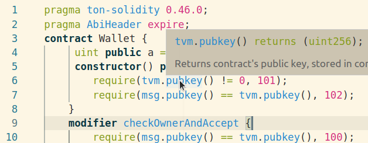
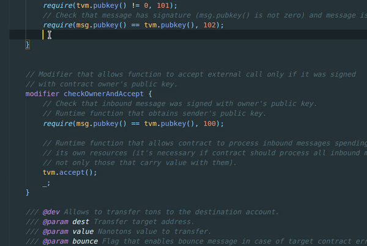
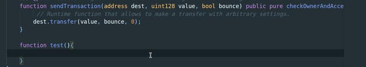
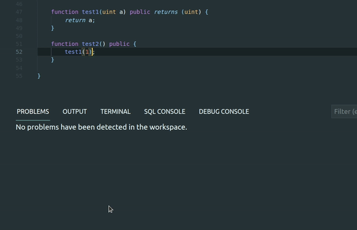
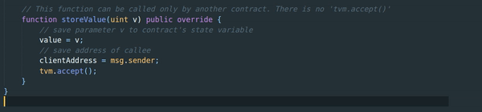
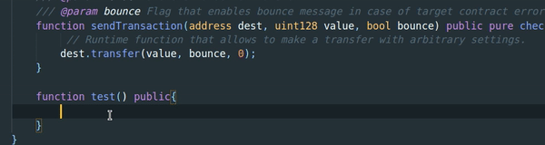
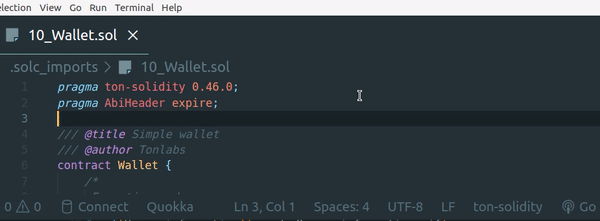

# TON Solidity support for Visual Studio Code

-----

TON Solidity is the language used in Free TON blockchain to create smart contracts. This extension provides:

* Syntax highlighting
* Snippets with details
* Checking for errors, warnings and highlighting it
* Display an information popup on hover
* Suggesting function params when typing
* DeBots interfaces highlighting, autocompletion, support for imports

-----

## Installation

### Extension Marketplace

Launch Quick Open, paste the following command, and press <kbd>Enter</kbd>

`ext install zfreeton.ton-solidity`

### CLI

With [shell commands](https://code.visualstudio.com/docs/editor/command-line) installed, you can use the following command to install the extension:

`$ code --install-extension zfreeton.ton-solidity`

## Features

### Highlighting

For example, light and dark themes: "Solarized Light" and "Material Theme":
   

### Ton-solidity autocomplete with detailed information

Use ```Ctrl+Space```



### Contract's functions autocompletion



### Code diagnostic on the fly



### On hover information



### Params helper



This extension only working with TON Solidity language. If You are using Ethereum Solidity, use other extensions for this.
You have quick switch between two solidity languages:



## How to contribute

If You found a typo or want to improve something, a pull request is welcome.
Some files meaning and locations:

```./src/snippets/completion.json``` — almost all completions snippets

```./src/snippets/hover.json``` — all hover popups

```./src/syntaxes/ton-solidity.json``` — syntax highlighting rules

## Contacts

Telegram: ```@tg2020ukraine```
